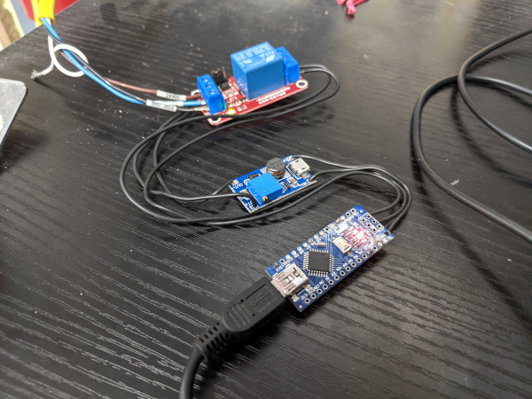
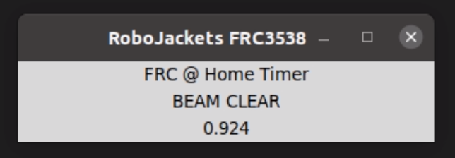

# RoboJackets FRC3538 - FRC @ Home Laser Timer  

This branch has two programs, one for an Arduino Nano and a python script. 

## Arduino Nano
The Arduino nano will relay the status of a laser beam-break sensor via USB Serial to the python script. Just plug in the Ardunio to the Driver station and it should power up the laser and start broadcasting the laser state.

## Python GUI
The Python script will monitor for the `[]\` Robot Enable Hotkey to start a timer. The timer will stop when the laser beam is broken. The GUI will display the state of the Laser Sensor as well. 

1. Set up the laser so it crosses the finish line.
2. Plug in the Arduino Nano to the Driver Station
3. Configure the COM port for the Arduino in the script: e.g.
   `serialPort = "COM5"`
4. Start the LaserTimer Python script and confirm that the Laser Status is working.
5. Click in the LaserTimer GUI before enabling the robot with the `[]\` Hotkey. 

